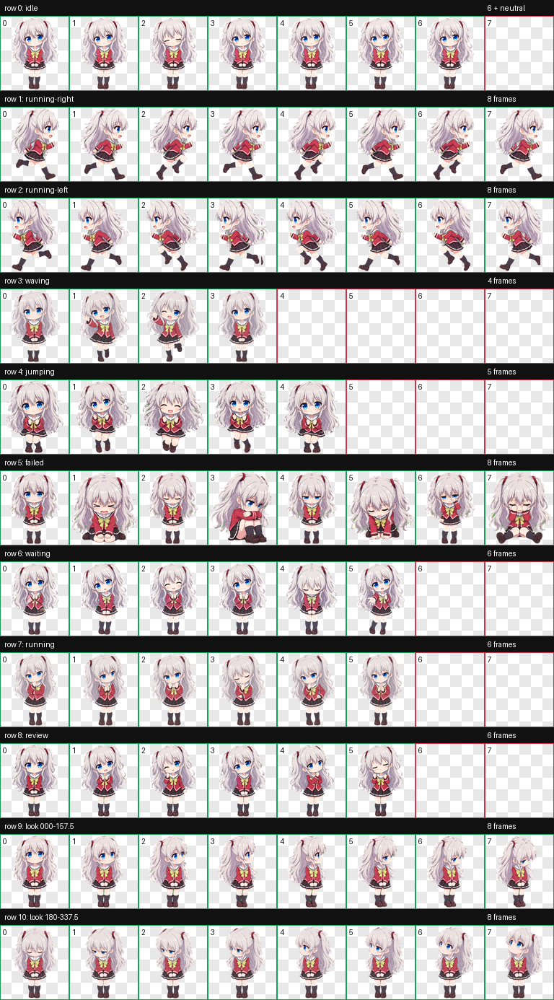

# 奈绪 · Codex Desktop Pet

一个适用于 Codex 桌面端的 v2 动画桌宠，以及可独立运行的 Windows「奈绪助手」。除了 9 类标准动画和 16 个注视方向，助手还提供专注提醒、状态气泡、语音、本地记忆、桌面工具与好感度系统。



## 动画

- 待机、左右移动、招手和蹦跳
- 失败/委屈、等待/撒娇、工作中、检查结果
- 16 个鼠标注视方向
- 8×11 图集，单元格 192×208，`spriteVersionNumber: 2`

## 安装

在 PowerShell 中运行：

```powershell
.\install.ps1
```

脚本会把 `pet` 目录复制到 `$CODEX_HOME/pets/nao`。未设置 `CODEX_HOME` 时，使用 `$HOME/.codex/pets/nao`。安装后重新启动 Codex，再从桌宠选择器中选择“奈绪”。

安装并启动增强版桌面助手：

```powershell
.\install-assistant.ps1
```

这会立即启动奈绪，并创建 Windows 登录启动项。只临时运行可使用 `.\start-nao.ps1`。

安装 Codex 状态桥接插件：

```powershell
.\install-plugin.ps1
```

安装后请新建一个 Codex 任务。插件会把“工作中、等待输入、完成、失败”等状态发送到奈绪的桌面气泡。

## 奈绪助手功能

- 番茄钟、休息和喝水提醒；到点播放语音并触发招手动画
- Codex 当前步骤、等待输入与完成结果气泡
- 点击说话、Windows 中文语音识别和系统语音回应
- 固定的可爱、依赖主人、略带傲娇角色语气
- 昵称、城市、偏好、待办、日程与习惯保存在 `%LOCALAPPDATA%\NaoCompanion\data.json`
- 天气查询、本地待办、媒体播放控制和可选剪贴板历史
- 互动好感度及四个关系等级
- 换装资源包引擎；制服图集已安装，睡衣和节日服装需要各自的完整动画图集

双击奈绪打开控制面板；右键可快速计时、控制音乐或退出。剪贴板历史默认关闭，开启后只保留最近 30 条并仅存本机。

也可以手动复制：

```text
pet/pet.json          -> ~/.codex/pets/nao/pet.json
pet/spritesheet.webp  -> ~/.codex/pets/nao/spritesheet.webp
```

## 动画触发

| 状态 | 触发场景 |
| --- | --- |
| idle | 空闲待机 |
| running-right / running-left | 左右拖动 |
| waving | 问候或提醒 |
| jumping | 活跃或庆祝事件 |
| failed | 任务失败、取消或阻塞 |
| waiting | 等待输入、确认或授权 |
| running | Codex 正在处理任务 |
| review | 任务完成并等待查看 |
| look directions | 鼠标在桌宠周围移动 |

## 文件

- `pet/`：可直接安装的桌宠包
- `app/nao/`：按界面、动画、计时、存储、语音、AI 和系统工具拆分的桌面程序
- `plugins/`：Codex 状态桥接插件与 MCP 服务
- `tests/`：不依赖桌面界面的核心服务测试
- `previews/`：动作总览和动画示例
- `install.ps1`：Windows 安装脚本

## 许可与声明

安装脚本、配置和仓库文档采用 [MIT License](LICENSE)。角色图像属于非商业同人衍生创作；相关原作角色、名称及设定权利归各自权利人所有。详见 [NOTICE.md](NOTICE.md)。
